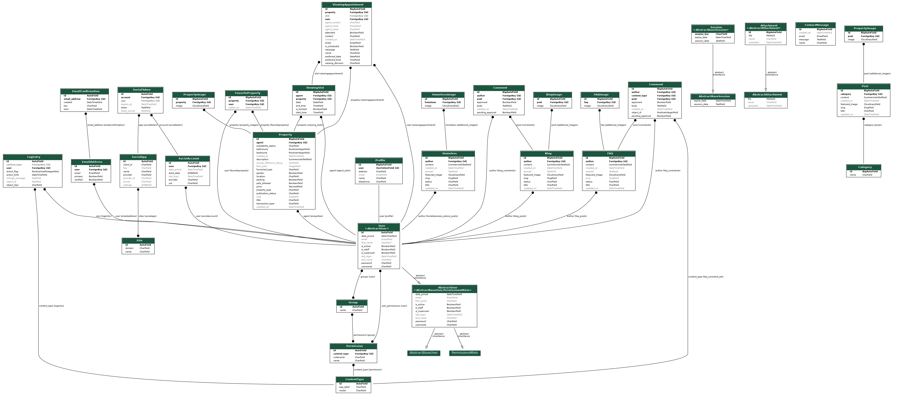

# Elysium Real Estate Django Project

Welcome to the Elysium Real Estate Django Project. This project is designed to manage real estate listings, blogs, FAQs, and various resources related to property management and homelessness advice.

## Table of Contents

- [User Experience](#user-experience)
  - [Strategy Plane](#strategy-plane)
  - [Scope Plane](#scope-plane)
  - [Structure Plane](#structure-plane)
  - [Skeleton Plane](#skeleton-plane)
  - [Surface Plane](#surface-plane)
- [Project Apps](#project-apps)
  - [Blog](#blog)
  - [Contact](#contact)
  - [FAQ](#faq)
  - [Home](#home)
  - [Homelessness Advice](#homelessness-advice)
  - [Mortgage Calculator](#mortgage-calculator)
  - [Property Guides](#property-guides)
  - [Real Estate](#real-estate)
- [Testing](#testing)
  - [Validator Testing](#validator-testing)
  - [Accessibility](#accessibility)
  - [Browser Testing](#browser-testing)
  - [Bugs](#bugs)
    - [Fixed Bugs](#fixed-bugs)
- [Technology](#technology)
- [Deployment](#deployment)
- [Credits](#credits)

## User Experience
The user experience (UX) of the Elysium Real Estate platform has been carefully crafted to provide a seamless and intuitive interaction for all users. Whether they are prospective property buyers, renters, or individuals seeking advice on homelessness, the platform offers a user-centric design that prioritizes ease of use, accessibility, and efficient navigation.

### Strategy Plane

The Elysium Real Estate platform is designed to offer users a comprehensive and user-friendly experience in managing and exploring real estate properties. The primary target audience includes real estate agents, property seekers, and individuals looking for information on homelessness. The platform is designed to:

- **Empower Users**: Provide users with all the tools and information they need to make informed decisions about property purchases, rentals, and other real estate-related activities.
- **Support Communities**: Offer resources and guidance for individuals experiencing homelessness or in need of housing advice.
- **Facilitate Engagement**: Through blogs, FAQs, and comment sections, the platform encourages community engagement and interaction among users.


### Scope Plane

The project encompasses multiple features:
- Property listings for sale, rent, student accommodation, and land for rent.
- Property management features including adding, updating, viewing, and deleting property listings.
- User functionalities for adding properties to favorites, managing account settings, and scheduling, amending, viewing, and canceling property viewings.
- Informational resources including property guides and homelessness advice pages.
- A blog section for publishing articles related to real estate and property management.
- An FAQ section to address common questions and provide helpful information.
- A contact form for users to send inquiries directly to the administrators.


### Structure Plane

The structure of the project is divided into several Django apps, each responsible for different functionalities. The main functionalities include property management, blogging, user interaction, and resource sharing.

### Skeleton Plane

The layout is structured to ensure ease of navigation. Key components include:
- A navbar with links to the main sections (Home, Properties, Blog, FAQ, Contact).
- A sidebar for additional resources like the Mortgage Calculator and Homelessness Advice.
- Consistent card-based layouts for property listings and blog entries.

### Surface Plane

The design focuses on a clean and modern look. The color scheme uses shades of blue and white to convey trust and professionalism. Buttons and links are styled to be prominent and user-friendly.

## Database Schema

Below is the database schema diagram for the Elysium Real Estate Django Project:



## Project Apps

### Blog

The `Blog` app allows administrators to create and manage blog posts that are displayed to users. Each post can include images, text, and comments.

#### Features:
- Create, update, view and delete blog posts.
- Create, update, view and delete comments for the blog posts. (with approval required for new comments or editing of current comments)

#### Models:
- `Blog`
- `Comment`
- `BlogImage`

### Contact

The `Contact` app provides a simple contact form where users can submit inquiries, which are stored in the database for the administrator to review.

#### Features:
- Contact form submission.

#### Models:
- `ContactMessage`

### FAQ

The `FAQ` app allows administrators to manage frequently asked questions, which are displayed to users in a structured format.

#### Features:
- Create, update, view and delete FAQ posts.
- Create, update, view and delete comments for the FAQ posts. (with approval required for new comments or editing of current comments)

#### Models:
- `FAQ`
- `FAQImage`
- `Comment`

### Home

The `Home` app manages the homepage and other static pages of the website.

#### Features:
- Displays featured properties.
- Links to other sections of the website.

#### Models:
- No specific models, relies on other apps for content.

### Homelessness Advice

The `Homelessness Advice` app provides articles and resources for individuals seeking advice on homelessness.

#### Features:
- Create, update, delete advice articles.
- Users can view articles with excerpts and full content.

#### Models:
- `Homeless`
- `HomelessImage`

### Mortgage Calculator

The `Mortgage Calculator` app provides a tool for users to estimate their mortgage payments based on input parameters like loan amount, interest rate, and term.

#### Features:
- Simple mortgage calculation based on user inputs.

#### Models:
- No specific models, purely functional.

### Property Guides

The `Property Guides` app provides informational guides on various property-related topics.

#### Features:
- Create, update, delete property guides.
- Users can view guides with detailed information.

#### Models:
- `Post`
- `PropertyImage`
- `Category`

### Real Estate

The `Real Estate` app manages property listings for sale, rent, and student accommodation. It includes features for property viewing appointments and user favorites.

#### Features:
- CRUD operations for properties.
- Manage viewing appointments.
- Add properties to favorites.

#### Models:
- `Property`
- `PropertyImage`
- `ViewingSlot`
- `ViewingAppointment`
- `FavoriteProperty`

## Testing

### Validator Testing

The project has been tested against several validators to ensure code quality and compliance with web standards.

### Accessibility

Accessibility has been tested using tools like Lighthouse to ensure the site is usable by people with disabilities.

### Browser Testing

The project has been tested on multiple browsers (Chrome, Firefox, Safari) to ensure cross-browser compatibility.

## Bugs

### Fixed Bugs

1. **HTML Validation Error:**
   - **Issue:** Validation errors were present on the signup.html page due to incorrect HTML structure.
   - **Fix:** Updated the signup.html page to ensure no validation errors, ensuring the HTML structure adheres to W3C standards.

2. **Issue with HTML Escaping in Summernote Content:**
   - **Issue:** Text entered through Summernote was being displayed with HTML escaping, causing issues with the rendered content.
   - **Fix:** A utility function was created in the `utils.py` file to clean and process the HTML content from Summernote. The function includes:
     - Replacing `<font>` tags with `<span>` tags to ensure proper styling.
     - Unescaping HTML entities.
     - Sanitizing the HTML using the `bleach` library, allowing specific tags, attributes, and styles while removing any harmful content.
     - Removing empty `style` attributes and trailing spaces to clean up the final HTML output.
   - **Code Snippet:**
     ```python
     import re
     import bleach
     from html import unescape

     def replace_font_with_span(html):
         font_open_tag_pattern = re.compile(r'<font\s+color="([^"]+)">')
         font_close_tag_pattern = re.compile(r'</font>')
         html = font_open_tag_pattern.sub(r'<span style="color:\1;">', html)
         html = font_close_tag_pattern.sub('</span>', html)
         return html

     def clean_html_content(html):
         html = unescape(html)
         allowed_tags = [
             'p', 'b', 'i', 'u', 'h1', 'h2', 'h3', 'h4', 'h5', 'h6',
             'span', 'ul', 'ol', 'li', 'strong', 'br', 'em', 'blockquote', 'a'
         ]
         allowed_attrs = {
             'span': ['style'],
             'a': ['href', 'title', 'style'],
             '*': ['style']
         }
         allowed_styles = ['color']
         html = replace_font_with_span(html)
         cleaned_html = bleach.clean(html, tags=allowed_tags, attributes=allowed_attrs, styles=allowed_styles, strip=False)
         cleaned_html = re.sub(r'style="\s*"', '', cleaned_html)
         cleaned_html = re.sub(r'\s+>', '>', cleaned_html)
         return cleaned_html
     ```

## Technology

- **Django**: The main framework used for development.
- **Cloudinary**: Used for image storage and management.
- **Django Summernote**: Rich text editor for blog and property descriptions.
- **Bootstrap**: Frontend framework for styling and responsiveness.
- **CIPostgreSQL**: Database for storing project data.
- **Python**: The programming language used for backend logic.
- **Graphviz**: Used to generate the database schema diagram.
- **JavaScript**: Used for enhancing user interactivity and front-end dynamic behavior.
- **HTML**: The standard markup language for creating web pages.
- **CSS**: Used for styling and designing the visual layout of the web pages.
- **Google Fonts**: Used for font styles in headers and other text elements.
- **DevTools**: Utilized for debugging, improvement, and use of device emulators.
- **Font Awesome**: Integrated for icons and font styles, especially in the footer.
- **ChatGPT 3.5**: Leveraged for reviewing code, finding discrepancies, and spell-checking.
- **HTML Validation Service**: Used for validating the structure and syntax of HTML files.
- **CSS Validation Service**: Used for ensuring that the CSS follows standards and is error-free.
- **Pixabay, Pexels, Unsplash, Shutterstock**: Sources for images used in the project.
- **Photopea**: An online tool used for resizing and editing images.

## Deployment

The project is deployed on Heroku. Follow these steps to deploy your own instance:

1. **Clone the repository**:
   ```bash
   git clone <repo_url>
