# Elysium Real Estate Django Project

Welcome to the Elysium Real Estate Django Project. This project is designed to manage real estate listings, blogs, FAQs, and various resources related to property management and homelessness advice.

## Table of Contents

- [User Experience](#user-experience)
  - [Strategy Plane](#strategy-plane)
  - [Scope Plane](#scope-plane)
  - [Structure Plane](#structure-plane)
  - [Skeleton Plane](#skeleton-plane)
  - [Surface Plane](#surface-plane)
- [Project Apps](#project-apps)
  - [Blog](#blog)
  - [Contact](#contact)
  - [FAQ](#faq)
  - [Home](#home)
  - [Homelessness Advice](#homelessness-advice)
  - [Mortgage Calculator](#mortgage-calculator)
  - [Property Guides](#property-guides)
  - [Real Estate](#real-estate)
- [Testing](#testing)
  - [Validator Testing](#validator-testing)
  - [Accessibility](#accessibility)
  - [Browser Testing](#browser-testing)
  - [Bugs](#bugs)
    - [Fixed Bugs](#fixed-bugs)
- [Technology](#technology)
- [Deployment](#deployment)
- [Credits](#credits)

## User Experience
The user experience (UX) of the Elysium Real Estate platform has been carefully crafted to provide a seamless and intuitive interaction for all users. Whether they are prospective property buyers, renters, or individuals seeking advice on homelessness, the platform offers a user-centric design that prioritizes ease of use, accessibility, and efficient navigation.

### Strategy Plane

The Elysium Real Estate platform is designed to offer users a comprehensive and user-friendly experience in managing and exploring real estate properties. The primary target audience includes real estate agents, property seekers, and individuals looking for information on homelessness. The platform is designed to:

- **Empower Users**: Provide users with all the tools and information they need to make informed decisions about property purchases, rentals, and other real estate-related activities.
- **Support Communities**: Offer resources and guidance for individuals experiencing homelessness or in need of housing advice.
- **Facilitate Engagement**: Through blogs, FAQs, and comment sections, the platform encourages community engagement and interaction among users.


### Scope Plane

The project encompasses multiple features:
- Property listings for sale, rent, student accommodation, and land for rent.
- Property management features including adding, updating, viewing, and deleting property listings.
- User functionalities for adding properties to favorites, managing account settings, and scheduling, amending, viewing, and canceling property viewings.
- Informational resources including property guides and homelessness advice pages.
- A blog section for publishing articles related to real estate and property management.
- An FAQ section to address common questions and provide helpful information.
- A contact form for users to send inquiries directly to the administrators.


### Structure Plane

The structure of the project is divided into several Django apps, each responsible for different functionalities. The main functionalities include property management, blogging, user interaction, and resource sharing.

### Skeleton Plane

The layout is structured to ensure ease of navigation. Key components include:
- A navbar with links to the main sections (Home, Properties, Blog, FAQ, Contact).
- A sidebar for additional resources like the Mortgage Calculator and Homelessness Advice.
- Consistent card-based layouts for property listings and blog entries.

### Surface Plane

The design focuses on a clean and modern look. The color scheme uses shades of blue and white to convey trust and professionalism. Buttons and links are styled to be prominent and user-friendly.

## Database Schema

Below is the database schema diagram for the Elysium Real Estate Django Project:

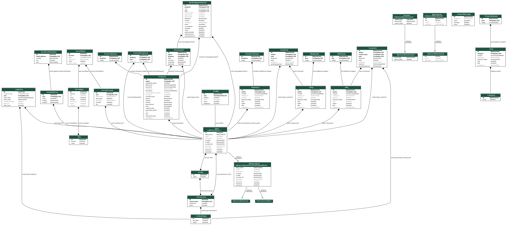

## Project Apps

### Blog

The `Blog` app allows administrators to create and manage blog posts that are displayed to users. Each post can include images, text, and comments.

#### Features:
- Create, update, view and delete blog posts.
- Create, update, view and delete comments for the blog posts. (with approval required for new comments or editing of current comments)

#### Models:
- `Blog`
- `Comment`
- `BlogImage`

### Contact

The `Contact` app provides a simple contact form where users can submit inquiries, which are stored in the database for the administrator to review.

#### Features:
- Contact form submission.

#### Models:
- `ContactMessage`

### FAQ

The `FAQ` app allows administrators to manage frequently asked questions, which are displayed to users in a structured format.

#### Features:
- Create, update, view and delete FAQ posts.
- Create, update, view and delete comments for the FAQ posts. (with approval required for new comments or editing of current comments)

#### Models:
- `FAQ`
- `FAQImage`
- `Comment`

### Home

The `Home` app manages the homepage and other static pages of the website.

#### Features:
- Displays featured properties.
- Links to other sections of the website.

#### Models:
- No specific models, relies on other apps for content.

### Homelessness Advice

The `Homelessness Advice` app provides articles and resources for individuals seeking advice on homelessness.

#### Features:
- Create, update, delete advice articles.
- Users can view articles with excerpts and full content.

#### Models:
- `Homeless`
- `HomelessImage`

### Mortgage Calculator

The `Mortgage Calculator` app provides a tool for users to estimate their mortgage payments based on input parameters like loan amount, interest rate, and term.

#### Features:
- Simple mortgage calculation based on user inputs.

#### Models:
- No specific models, purely functional.

### Property Guides

The `Property Guides` app provides informational guides on various property-related topics.

#### Features:
- Create, update, delete property guides.
- Users can view guides with detailed information.

#### Models:
- `Post`
- `PropertyImage`
- `Category`

### Real Estate

The `Real Estate` app manages property listings for sale, rent, and student accommodation. It includes features for property viewing appointments and user favorites.

#### Features:
- CRUD operations for properties.
- Manage viewing appointments.
- Add properties to favorites.

#### Models:
- `Property`
- `PropertyImage`
- `ViewingSlot`
- `ViewingAppointment`
- `FavoriteProperty`

## Testing

### Running Tests

To ensure that the application is functioning correctly, you can run the Django tests and JavaScript tests as shown below:

#### Django Tests (Python)

## Test Coverage Summary

### Blog Application

| **Test File**            | **Test Description**                                                                 | **Expected Outcome**                                                    |
|--------------------------|--------------------------------------------------------------------------------------|-------------------------------------------------------------------------|
| `TestBlogAdmin`           | Tests inheritance, list display, search fields, prepopulated fields, and inlines in `BlogAdmin`. | Admin configuration for `Blog` models is correct.                      |
| `TestCommentAdmin`        | Tests list display, list filter, and search fields in `CommentAdmin`.                | Admin configuration for `Comment` models is correct.                    |
| `TestBlogImageInline`     | Tests model and extra settings in `BlogImageInline`.                                 | `BlogImageInline` is correctly configured.                              |
| `TestCommentForm`         | Tests validity, empty data, and form fields of `CommentForm`.                        | `CommentForm` validation works as expected.                             |
| `BlogModelTest`           | Tests creation of a `Blog` and its string representation.                            | `Blog` model behaves correctly when created.                            |
| `CommentModelTest`        | Tests creation of a `Comment` and its string representation.                         | `Comment` model behaves correctly when created.                         |
| `BlogImageModelTest`      | Tests creation of `BlogImage` and its string representation.                         | `BlogImage` model behaves correctly when created.                       |
| `UtilsTestCase`           | Tests utility functions: `replace_font_with_span` and `clean_html_content`.          | HTML content is cleaned and font tags are replaced with spans.          |
| `BlogListViewTest`        | Tests the `Blog` list view rendering and response.                                   | Blog list view displays published blogs correctly.                      |
| `BlogDetailViewTest`      | Tests `Blog` detail view for GET and POST requests.                                  | Blog detail view displays content and handles comment submissions.      |
| `CommentEditViewTest`     | Tests editing a comment via the comment edit view.                                   | Comments can be edited, and status is updated.                          |
| `DeleteCommentViewTest`   | Tests deleting a comment via the delete comment view.                                | Comments are deleted correctly through the view.                        |

### Contact Application

| **Test File**            | **Test Description**                                                                 | **Expected Outcome**                                                    |
|--------------------------|--------------------------------------------------------------------------------------|-------------------------------------------------------------------------|
| `ContactMessageAdminTest` | Tests list display and search fields in `ContactMessageAdmin`.                       | Admin configuration for `ContactMessage` models is correct.             |
| `ContactFormTest`         | Tests validity and invalidity of `ContactForm`.                                      | `ContactForm` validation works as expected.                             |
| `ContactMessageModelTest` | Tests creation and string representation of `ContactMessage`.                        | `ContactMessage` model behaves correctly when created.                  |
| `ContactMessageViewTest`  | Tests `Contact` message view for GET and POST requests.                              | `Contact` message view displays form and handles submissions correctly. |

### FAQ Application

| **Test File**            | **Test Description**                                                                 | **Expected Outcome**                                                    |
|--------------------------|--------------------------------------------------------------------------------------|-------------------------------------------------------------------------|
| `TestFAQAdmin`            | Tests inheritance, list display, search fields, prepopulated fields, and inlines in `FAQAdmin`. | Admin configuration for `FAQ` models is correct.                        |
| `TestCommentAdmin`        | Tests list display, list filter, search fields, and custom actions in `CommentAdmin`. | Admin configuration for `Comment` models is correct.                    |
| `TestFAQImageInline`      | Tests model and extra settings in `FAQImageInline`.                                  | `FAQImageInline` is correctly configured.                               |
| `CommentFormTest`         | Tests validity and invalidity of `CommentForm`.                                      | `CommentForm` validation works as expected.                             |
| `FAQModelTest`            | Tests creation and string representation of `FAQ`.                                   | `FAQ` model behaves correctly when created.                             |
| `CommentModelTest`        | Tests creation of a `Comment` and its string representation.                         | `Comment` model behaves correctly when created.                         |
| `UtilsTestCase`           | Tests utility functions: `replace_font_with_span` and `clean_html_content`.          | HTML content is cleaned and font tags are replaced with spans.          |
| `FAQViewTest`             | Tests the `FAQ` list and detail views, adding, editing, and deleting comments.        | `FAQ` views display content correctly, and comments are handled properly.|

### Home Application

| **Test File**            | **Test Description**                                                                 | **Expected Outcome**                                                    |
|--------------------------|--------------------------------------------------------------------------------------|-------------------------------------------------------------------------|
| `HomeViewTest`            | Tests the `home` view for GET requests and filtering search results based on different parameters. | The `home` view renders correctly and filters properties as expected.  |
| `PropertySaleViewTest`    | Tests the `property_sale` view for GET requests.                                     | The `property_sale` view renders the appropriate template.             |
| `PropertyRentViewTest`    | Tests the `property_rent` view for GET requests.                                     | The `property_rent` view renders the appropriate template.             |

### Real Estate Application

| **Test File**            | **Test Description**                                                                 | **Expected Outcome**                                                    |
|--------------------------|--------------------------------------------------------------------------------------|-------------------------------------------------------------------------|
| `PropertyModelTests`      | Tests creation and string representation of `Property`, and its price display and slug creation. | `Property` model behaves correctly when created.                        |
| `PropertyImageModelTests` | Tests creation and string representation of `PropertyImage`.                        | `PropertyImage` model behaves correctly when created.                   |
| `FavoritePropertyModelTests` | Tests creation and unique constraint of `FavoriteProperty`.                      | `FavoriteProperty` model behaves correctly when created, with unique constraint working. |
| `ViewingSlotModelTests`   | Tests creation and string representation of `ViewingSlot`, and its booking status.  | `ViewingSlot` model behaves correctly when created.                     |
| `ViewingAppointmentModelTests` | Tests creation and string representation of `ViewingAppointment`, and its viewing decision. | `ViewingAppointment` model behaves correctly when created.            |
| `ProfileModelTests`       | Tests creation and update of `Profile`, and its string representation.              | `Profile` model behaves correctly when created and updated.             |
| `UserSignalTests`         | Tests signals related to user creation and profile update.                          | User profiles are created and updated correctly through signals.        |
| `UtilsTestCase`           | Tests utility functions: `replace_font_with_span` and `clean_html_content`.         | HTML content is cleaned and font tags are replaced with spans.          |
| `PropertyViewTests`       | Tests various views related to `Property`, including details, favorites, search, and viewing requests. | Property-related views render correctly and handle data as expected.    |
| `PropertySearchFormTest`  | Tests the `PropertySearchForm` for various validity checks.                         | `PropertySearchForm` behaves correctly with valid and invalid data.     |
| `ViewingAppointmentFormTest` | Tests the `ViewingAppointmentForm` for validity checks and date validation.      | `ViewingAppointmentForm` validates data correctly, including dates.     |
| `ProfileUpdateFormTest`   | Tests the `ProfileUpdateForm` for validity.                                         | `ProfileUpdateForm` behaves correctly with valid data.                  |
| `ChangePasswordFormTest`  | Tests the `ChangePasswordForm` for validity.                                        | `ChangePasswordForm` validates password changes correctly.              |
| `DeleteAccountFormTest`   | Tests the `DeleteAccountForm` for validity.                                         | `DeleteAccountForm` behaves correctly with valid data.                  |
| `AdminSiteTests`          | Tests admin site views for `Property`, `ViewingSlot`, `FavoriteProperty`, and `ViewingAppointment`. | Admin views for real estate-related models render correctly.            |

### Homeless Advice Application

| **Test File**            | **Test Description**                                                                 | **Expected Outcome**                                                    |
|--------------------------|--------------------------------------------------------------------------------------|-------------------------------------------------------------------------|
| `HomelessAdminTests`      | Tests the admin interface for `Homeless` and `HomelessImage` models, including list view and change view. | Admin interface for `Homeless` models is correctly configured and displays data as expected. |
| `HomelessFormTests`       | Tests the validity and invalidity of the `HomelessForm`.                             | `HomelessForm` behaves correctly with valid and invalid data.           |
| `HomelessModelTests`      | Tests creation and string representation of `Homeless` and `HomelessImage` models.   | `Homeless` and `HomelessImage` models behave correctly when created.    |
| `UtilsTestCase`           | Tests utility functions: `replace_font_with_span` and `clean_html_content`.          | HTML content is cleaned and font tags are replaced with spans.          |
| `HomelessViewTests`       | Tests the `homeless` list view and detail view, including 404 for non-existent slugs. | `Homeless` views render correctly and handle non-existent slugs properly. |

### Property Guides Application

| **Test File**            | **Test Description**                                                                 | **Expected Outcome**                                                    |
|--------------------------|--------------------------------------------------------------------------------------|-------------------------------------------------------------------------|
| `TestPostAdmin`           | Tests the admin interface for the `Post` model, including list display, search fields, and inlines. | Admin interface for `Post` model is correctly configured and displays data as expected. |
| `TestCategoryAdmin`       | Tests the admin interface for the `Category` model, including list display and search fields. | Admin interface for `Category` model is correctly configured and displays data as expected. |
| `TestPropertyImageInline` | Tests the inline admin for `PropertyImage` associated with `Post`.                  | `PropertyImage` inlines are correctly displayed in the `Post` admin.   |
| `TestPostForm`            | Tests the `PostForm` for valid and invalid data, including slug validation.          | `PostForm` behaves correctly with valid and invalid data.               |
| `CategoryModelTest`       | Tests the creation and string representation of the `Category` model.                | `Category` model behaves correctly when created.                        |
| `PostModelTest`           | Tests the creation, slug generation, and string representation of the `Post` model.  | `Post` model behaves correctly when created, with correct slug generation. |
| `PropertyImageModelTest`  | Tests the creation and string representation of the `PropertyImage` model.           | `PropertyImage` model behaves correctly when created.                   |
| `UtilsTestCase`           | Tests utility functions: `replace_font_with_span` and `clean_html_content`.          | HTML content is cleaned and font tags are replaced with spans.          |
| `PropertyGuidesCategoryViewTest` | Tests the category view for property guides, ensuring posts are correctly displayed under the right category. | Property guides category views display posts correctly by category.    |


## Test Terminal Results Summary

```bash
$ python manage.py test
Found 144 test(s).
Creating test database for alias 'default'...
System check identified no issues (0 silenced).
............................................................./workspace/elysium-realestate-django/real_estate/views.py:23: UnorderedObjectListWarning: Pagination may yield inconsistent results with an unordered object_list: <class 'real_estate.models.Property'> QuerySet.
  paginator = Paginator(properties, per_page)
.Initial properties count: 0
/workspace/elysium-realestate-django/real_estate/views.py:163: UnorderedObjectListWarning: Pagination may yield inconsistent results with an unordered object_list: <class 'real_estate.models.Property'> QuerySet.
  paginator = Paginator(properties, 20)
Final properties in page: 0
.................................................................Initial properties count: 1
Filtered properties count: 1
/workspace/elysium-realestate-django/real_estate/views.py:163: UnorderedObjectListWarning: Pagination may yield inconsistent results with an unordered object_list: <class 'real_estate.models.Property'> QuerySet.
  paginator = Paginator(properties, 20)
Final properties in page: 1
.Initial properties count: 1
Filtered properties count: 1
/workspace/elysium-realestate-django/real_estate/views.py:163: UnorderedObjectListWarning: Pagination may yield inconsistent results with an unordered object_list: <class 'real_estate.models.Property'> QuerySet.
  paginator = Paginator(properties, 20)
Final properties in page: 1
................
----------------------------------------------------------------------
Ran 144 tests in 21.279s

OK
Destroying test database for alias 'default'...


### Python Tests
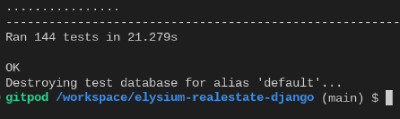

#### Django Tests (JavaScript)

## Test Coverage Summary

This table provides a detailed overview of each test carried out in the project, including the purpose, expected outcome, and key functions tested.

| **Test File**                         | **Test Description**                                                                                         | **Expected Outcome**                                                   |
|---------------------------------------|--------------------------------------------------------------------------------------------------------------|------------------------------------------------------------------------|
| **addToFavorites.test.js**            | Test adding a property to favorites successfully.                                                            | Property is added to favorites, and success message is shown.          |
| **addToFavorites.test.js**            | Test handling error when adding property to favorites.                                                       | An error is thrown, and error message is shown.                        |
| **carousel.test.js**                  | Test initializing the carousel with the first thumbnail as the active image.                                 | First thumbnail is set as the active image.                            |
| **carousel.test.js**                  | Test updating the large image and active thumbnail on next button click.                                      | Large image and active thumbnail update correctly.                     |
| **carousel.test.js**                  | Test updating the large image and active thumbnail on prev button click.                                      | Large image and active thumbnail update correctly.                     |
| **carousel.test.js**                  | Test updating the large image and active thumbnail on thumbnail click.                                        | Large image and active thumbnail update correctly.                     |
| **clearModalMessages.test.js**        | Test clearing the modal message content.                                                                     | Modal message content is cleared.                                      |
| **clearModalMessages.test.js**        | Test hiding the modal.                                                                                        | Modal is hidden.                                                       |
| **clearModalMessages.test.js**        | Test not throwing an error if `modalMessage` is not found.                                                    | No error is thrown.                                                    |
| **setupEventListeners.test.js**       | Test calling `requestCustomViewing` when custom viewing form is submitted.                                    | `requestCustomViewing` is called with the correct property ID.         |
| **setupEventListeners.test.js**       | Test calling `addToFavorites` when property action button is clicked.                                         | `addToFavorites` is called with correct arguments.                     |
| **setupEventListeners.test.js**       | Test calling `removeFromFavorites` when remove favorite button is clicked.                                    | `removeFromFavorites` is called with correct arguments.                |
| **setupEventListeners.test.js**       | Test calling `closeSidebar` when close sidebar button is clicked.                                             | `closeSidebar` is called.                                              |
| **setupEventListeners.test.js**       | Test validating date input when preferred date input is changed.                                              | `validateDate` is called.                                              |
| **setupEventListeners.test.js**       | Test showing modal message when update viewing form is submitted with a valid date.                           | `showModalMessage` is called with a success message.                   |
| **setupEventListeners.test.js**       | Test preventing form submission when search button is clicked without input.                                  | Alert is shown, and form submission is prevented.                      |
| **collapsible.test.js**               | Test toggling collapsible content on button click.                                                            | Collapsible content toggles correctly.                                 |
| **collapsible.test.js**               | Test closing collapsible content on close button click.                                                       | Collapsible content closes correctly.                                  |
| **deleteComment.test.js**             | Test showing delete modal when delete button is clicked.                                                      | Delete modal is shown.                                                 |
| **deleteComment.test.js**             | Test calling `fetch` to delete the comment.                                                                   | Fetch API is called with the correct parameters.                       |
| **editComment.test.js**               | Test showing modal with comment body on edit button click.                                                    | Modal is shown with correct comment body.                              |
| **getCSRFToken.test.js**              | Test returning correct CSRF token from `document.cookie`.                                                     | CSRF token is returned correctly.                                      |
| **getCSRFToken.test.js**              | Test returning `null` if no CSRF token is found in `document.cookie`.                                          | `null` is returned.                                                    |
| **mortgageCalculation.test.js**       | Test calculating mortgage with basic inputs.                                                                  | Mortgage is calculated correctly with expected values.                 |
| **mortgageCalculation.test.js**       | Test validating zero or negative values when calculating mortgage.                                            | An error is thrown for invalid inputs.                                 |
| **mortgageCalculation.test.js**       | Test validating deposit greater than property price.                                                          | An error is thrown for invalid inputs.                                 |
| **mortgageCalculation.test.js**       | Test calculating mortgage with different valid inputs.                                                        | Mortgage is calculated correctly with expected values.                 |
| **removeFromFavorites.test.js**       | Test removing property from favorites successfully.                                                           | Property is removed from favorites, and success message is shown.      |
| **removeFromFavorites.test.js**       | Test handling error when removing property from favorites.                                                    | An error is thrown, and error message is shown.                        |
| **requestCustomViewing.test.js**      | Test sending custom viewing request successfully.                                                             | Custom viewing request is sent, and success message is shown.          |
| **requestCustomViewing.test.js**      | Test handling error when sending custom viewing request.                                                      | An error is thrown, and error message is shown.                        |
| **requestCustomViewing.test.js**      | Test handling invalid date when sending custom viewing request.                                               | Validation fails, and fetch is not called.                             |
| **requestSlotViewing.test.js**        | Test requesting slot viewing successfully.                                                                    | Slot viewing request is sent, and success message is shown.            |
| **requestSlotViewing.test.js**        | Test handling error when requesting slot viewing.                                                             | An error is thrown, and error message is shown.                        |
| **script.test.js**                    | Test CSRF token retrieval from cookies.                                                                       | CSRF token is retrieved correctly.                                     |
| **script.test.js**                    | Test showing modal message with correct content.                                                              | Modal message is shown with correct content.                           |
| **script.test.js**                    | Test clearing modal messages and hiding the modal.                                                            | Modal messages are cleared, and modal is hidden.                       |
| **script.test.js**                    | Test validating correct UK contact numbers.                                                                   | Contact numbers are validated correctly.                               |
| **script.test.js**                    | Test validating dates correctly.                                                                              | Dates are validated correctly.                                         |
| **script.test.js**                    | Test adding property to favorites.                                                                            | Property is added to favorites.                                        |
| **script.test.js**                    | Test removing property from favorites.                                                                        | Property is removed from favorites.                                    |
| **script.test.js**                    | Test requesting custom viewing.                                                                               | Custom viewing request is sent.                                        |
| **script.test.js**                    | Test requesting slot viewing.                                                                                 | Slot viewing request is sent.                                          |
| **script.test.js**                    | Test closing the sidebar.                                                                                     | Sidebar is closed.                                                     |
| **script.test.js**                    | Test moving to the next step in multi-step form.                                                              | Next step is activated correctly.                                      |
| **script.test.js**                    | Test moving to the previous step in multi-step form.                                                          | Previous step is activated correctly.                                  |
| **script.test.js**                    | Test updating the term value display.                                                                         | Term value is updated correctly.                                       |
| **toggleFavorite.test.js**            | Test toggling the favorite state of a property.                                                               | Favorite state is toggled correctly.                                   |
| **updateViewing.test.js**             | Test showing update modal when update button is clicked.                                                      | Update modal is shown.                                                 |
| **updateViewing.test.js**             | Test validating and submitting the update viewing form.                                                       | Viewing is updated successfully, and page reloads.                     |
| **validateContactNumber.test.js**     | Test validating correct UK mobile numbers.                                                                    | UK mobile numbers are validated correctly.                             |
| **validateDate.test.js**              | Test validating future dates correctly.                                                                       | Future dates are validated correctly.                                  |
| **validateDate.test.js**              | Test returning `false` for past dates.                                                                        | Validation fails for past dates.                                       |
| **validateDate.test.js**              | Test returning `false` for invalid date format.                                                               | Validation fails for invalid dates.                                    |

## Test Terminal Results Summary

$ npx jest
 PASS  static/__tests__/getCSRFToken.test.js (7.191 s)
 PASS  static/__tests__/clearModalMessages.test.js (7.501 s)
 PASS  static/__tests__/toggleFavorite.test.js (7.6 s)
 PASS  static/__tests__/editComment.test.js (7.797 s)
 PASS  static/__tests__/validateDate.test.js (7.399 s)
 PASS  static/__tests__/showModalMessage.test.js (7.991 s)
 PASS  static/__tests__/collapsible.test.js (7.8 s)
 PASS  static/__tests__/mortgageCalculation.test.js (8.197 s)
 PASS  static/__tests__/validateContactNumber.test.js (8.105 s)
 PASS  static/__tests__/carousel.test.js (8.8 s)
 PASS  static/__tests__/deleteComment.test.js (9.595 s)
 PASS  static/__tests__/updateViewing.test.js (10.096 s)
 PASS  static/__tests__/addToFavorites.test.js (10.202 s)
 PASS  static/__tests__/removeFromFavorites.test.js (10.712 s)
 PASS  static/__tests__/requestSlotViewing.test.js (10.608 s)
 PASS  static/__tests__/requestCustomViewing.test.js (11.118 s)
 PASS  static/__tests__/closeSidebar.test.js (11.324 s)
 PASS  static/__tests__/script.test.js (11.617 s)
 PASS  static/__tests__/setupEventListeners.test.js (11.403 s)

Test Suites: 19 passed, 19 total
Tests:       76 passed, 76 total
Snapshots:   0 total
Time:        17.602 s
Ran all test suites.

### JavaScript Tests
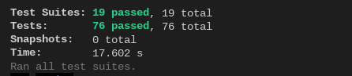


#### Manual Tests

| **Test Case**                                           | **Test Action**                                                                                          | **Expected Outcome**                                                                           | **URL/Location**                                          |
|---------------------------------------------------------|-----------------------------------------------------------------------------------------------------------|------------------------------------------------------------------------------------------------|-----------------------------------------------------------|
| **Sign Up**                                             | Fill in the sign-up form and click "Sign Up".                                                              | The user is registered, logged in, and redirected to the dashboard/home page.                  | /signup/                                                  |
| **Add Property to Favorites (Property Detail)**         | Navigate to a property detail page and click the "Add to Favorites" button.                                | Property is added to the user's favorites and is viewable in /real_estate/favorites/.          | /real_estate/property/<property-slug>/                    |
| **Add Property to Favorites (Property Sale Page)**      | On the property sale page, click the "Add to Favorites" button on a property.                              | Property is added to the user's favorites and is viewable in /real_estate/favorites/.          | /real_estate/property_sale/                               |
| **Add Property to Favorites (Property Rent Page)**      | On the property rent page, click the "Add to Favorites" button on a property.                              | Property is added to the user's favorites and is viewable in /real_estate/favorites/.          | /real_estate/property_rent/                               |
| **Add Property to Favorites (Student Property Page)**   | On the student property page, click the "Add to Favorites" button on a property.                           | Property is added to the user's favorites and is viewable in /real_estate/favorites/.          | /real_estate/student_property/                            |
| **Add Property to Favorites (Land Page)**               | On the land property page, click the "Add to Favorites" button on a property.                              | Property is added to the user's favorites and is viewable in /real_estate/favorites/.          | /real_estate/view_land/                                   |
| **Remove Property from Favorites**                      | On the favorites page, click the "Remove from Favorites" button on a property.                             | Property is removed from the user's favorites and no longer viewable in /real_estate/favorites/. | /real_estate/favorites/                                   |
| **Book a Viewing Slot**                                 | On a property detail page, select an available viewing slot and click "Book".                              | Viewing slot is booked, and a confirmation message is displayed.                               | /real_estate/property/<property-slug>/                    |
| **Submit a Custom Viewing Request**                     | Fill in the custom viewing request form and click "Submit".                                                | Custom viewing request is submitted, and success message is displayed.                         | /real_estate/request_custom_viewing/                      |
| **Update Viewing Appointment**                          | Edit an existing viewing appointment and click "Save".                                                     | Viewing appointment is updated, and changes are reflected in the viewing list.                 | /real_estate/update_viewing/<viewing-id>/                 |
| **Delete Viewing Appointment**                          | On the viewing appointments page, click "Delete" on an appointment.                                        | Viewing appointment is deleted and no longer viewable in the list.                             | /real_estate/pending_viewings/                            |
| **Filter Properties for Sale**                          | Use the search form to filter properties by price, location, and type.                                     | The property list updates to show only those matching the filter criteria.                     | /real_estate/property_sale/                               |
| **Filter Properties for Rent**                          | Use the search form to filter properties by price, location, and type.                                     | The property list updates to show only those matching the filter criteria.                     | /real_estate/property_rent/                               |
| **Filter Properties for Student**                       | Use the search form to filter student properties by price, location, and type.                             | The property list updates to show only those matching the filter criteria.                     | /real_estate/student_property/                            |
| **Calculate Mortgage**                                  | Enter property price, deposit, interest rate, and term, then click "Calculate".                             | Mortgage details are calculated and displayed.                                                 | /real_estate/mortgage_calculator/                         |
| **Calculate Mortgage with Invalid Data**                | Enter negative or empty values in the mortgage calculator and click "Calculate".                            | Validation errors are shown, and mortgage is not calculated.                                   | /real_estate/mortgage_calculator/                         |
| **Toggle Collapsible on Property Guides Detail**        | Click on the collapsible sections on the property guides detail page.                                       | Collapsible sections open and close as expected.                                               | /property_guides/<property-guide-slug>/                   |
| **Toggle Collapsible on Homelessness Advice Detail**    | Click on the collapsible sections on the homelessness advice detail page.                                   | Collapsible sections open and close as expected.                                               | /homelessness_advice/<homelessness-advice-slug>/          |
| **Test Social Media Links (Facebook)**                  | Click the Facebook icon/link in the footer or header.                                                       | The Facebook page opens in a new tab.                                                          | Footer/Header                                             |
| **Test Social Media Links (Twitter)**                   | Click the Twitter icon/link in the footer or header.                                                        | The Twitter page opens in a new tab.                                                           | Footer/Header                                             |
| **Test Social Media Links (YouTube)**                   | Click the YouTube icon/link in the footer or header.                                                        | The YouTube channel opens in a new tab.                                                        | Footer/Header                                             |
| **Test Social Media Links (Instagram)**                 | Click the Instagram icon/link in the footer or header.                                                      | The Instagram page opens in a new tab.                                                         | Footer/Header                                             |
| **Test Footer Menu Links (Buy)**                        | Click the "Buy" link in the footer menu.                                                                    | The user is redirected to the property sale page.                                              | Footer Menu                                               |
| **Test Footer Menu Links (Rent)**                       | Click the "Rent" link in the footer menu.                                                                   | The user is redirected to the property rent page.                                              | Footer Menu                                               |
| **Test Footer Menu Links (Property Guides)**            | Click the "Property Guides" link in the footer menu.                                                        | The user is redirected to the property guides page.                                            | Footer Menu                                               |
| **Test Footer Menu Links (Blogs)**                      | Click the "Blogs" link in the footer menu.                                                                  | The user is redirected to the blog list page.                                                  | Footer Menu                                               |
| **Test Footer Menu Links (Homelessness Advice)**        | Click the "Homelessness Advice" link in the footer menu.                                                     | The user is redirected to the homelessness advice page.                                        | Footer Menu                                               |
| **Test Footer Menu Links (FAQ)**                        | Click the "FAQ" link in the footer menu.                                                                    | The user is redirected to the FAQ page.                                                        | Footer Menu                                               |
| **Test Footer Menu Links (Mortgage Calculator)**        | Click the "Mortgage Calculator" link in the footer menu.                                                     | The user is redirected to the mortgage calculator page.                                        | Footer Menu                                               |
| **Submit a Comment on a Blog Post**                     | Fill in the comment form on a blog post and click "Submit".                                                  | Comment is submitted and displayed under the blog post.                                        | /blog/<blog-slug>/                                        |
| **Edit a Comment on a Blog Post**                       | Click "Edit" on an existing comment, make changes, and click "Save".                                         | Comment is updated, and changes are reflected on the blog post.                                | /blog/<blog-slug>/                                        |
| **Delete a Comment on a Blog Post**                     | Click "Delete" on an existing comment.                                                                       | Comment is deleted and no longer visible on the blog post.                                     | /blog/<blog-slug>/                                        |
| **Submit a Comment on an FAQ Post**                     | Fill in the comment form on an FAQ post and click "Submit".                                                  | Comment is submitted and displayed under the FAQ post.                                         | /faq/<faq-slug>/                                          |
| **Edit a Comment on an FAQ Post**                       | Click "Edit" on an existing comment, make changes, and click "Save".                                         | Comment is updated, and changes are reflected on the FAQ post.                                 | /faq/<faq-slug>/                                          |
| **Delete a Comment on an FAQ Post**                     | Click "Delete" on an existing comment.                                                                       | Comment is deleted and no longer visible on the FAQ post.                                      | /faq/<faq-slug>/                                          |
| **Log In**                                              | Enter valid credentials and click "Log In".                                                                  | The user is logged in and redirected to the dashboard/home page.                               | /login/                                                   |
| **Log Out**                                             | Click the "Log Out" button.                                                                                  | The user is logged out and redirected to the home page.                                        | /logout/                                                  |
| **Schedule a Viewing or Adding to Favorites Without Login** | Attempt to schedule a viewing or add a property to favorites without logging in.                             | The user is prompted to log in with a modal or redirect to the login page.                     | Any property detail page                                  |
| **Prevent Scheduling Viewing in the Past**              | Attempt to select a past date when scheduling or updating a viewing appointment.                              | Validation prevents past dates from being selected, and an error is shown.                     | /real_estate/property/<property-slug>/                    |
| **Search for Properties on Home Page**                  | Use the search functionality on the home page to search for properties to rent or buy.                       | The user is redirected to the appropriate rent or buy page with filtered results.              | /real_estate/                                             |


#### Django Admin Panel Tests

### Admin Panel Tests

| **Test Case**                                           | **Test Action**                                                                                     | **Expected Outcome**                                                                                       |
|---------------------------------------------------------|------------------------------------------------------------------------------------------------------|--------------------------------------------------------------------------------------------------------------|
| **Log In to Admin Panel**                               | Enter valid credentials and click "Log In" on the admin panel login page.                            | The admin user is logged in and redirected to the admin dashboard.                                           |
| **Log Out of Admin Panel**                              | Click the "Log Out" button in the admin panel.                                                       | The admin user is logged out and redirected to the admin login page.                                         |
| **Add Email Address in Accounts**                       | Navigate to the "Accounts > Email addresses" section and click "Add".                                | New email address is added successfully.                                                                     |
| **Change Email Address in Accounts**                    | Select an existing email address and modify its details.                                             | Changes are saved, and the email address details are updated.                                                |
| **Delete Email Address in Accounts**                    | Select an existing email address and delete it.                                                      | Email address is deleted, and it no longer appears in the list.                                              |
| **Add Group in Authentication and Authorization**       | Navigate to the "Groups" section and click "Add".                                                    | New group is added successfully.                                                                             |
| **Change Group in Authentication and Authorization**    | Select an existing group and modify its details.                                                     | Changes are saved, and the group details are updated.                                                        |
| **Delete Group in Authentication and Authorization**    | Select an existing group and delete it.                                                              | Group is deleted, and it no longer appears in the list.                                                      |
| **Add User in Authentication and Authorization**        | Navigate to the "Users" section and click "Add".                                                     | New user is added successfully.                                                                              |
| **Change User in Authentication and Authorization**     | Select an existing user and modify its details.                                                      | Changes are saved, and the user details are updated.                                                         |
| **Delete User in Authentication and Authorization**     | Select an existing user and delete them.                                                             | User is deleted, and it no longer appears in the list.                                                       |
| **Add Blog in Blog Section**                            | Navigate to the "Blogs" section and click "Add".                                                     | New blog post is added successfully, and images (if any) are uploaded.                                       |
| **Change Blog in Blog Section**                         | Select an existing blog post and modify its details.                                                 | Changes are saved, and the blog post details are updated.                                                    |
| **Delete Blog in Blog Section**                         | Select an existing blog post and delete it.                                                          | Blog post and all associated comments are deleted, and it no longer appears in the list.                     |
| **Add Comment in Blog Section**                         | Navigate to the "Comments" section and click "Add".                                                  | New comment is added successfully.                                                                           |
| **Change Comment in Blog Section**                      | Select an existing comment and modify its details.                                                   | Changes are saved, and the comment details are updated.                                                      |
| **Delete Comment in Blog Section**                      | Select an existing comment and delete it.                                                            | Comment is deleted and no longer appears in the list.                                                        |
| **Add Contact Message in Contact Section**              | Navigate to the "Contact messages" section and click "Add".                                          | New contact message is added successfully.                                                                   |
| **Change Contact Message in Contact Section**           | Select an existing contact message and modify its details.                                           | Changes are saved, and the contact message details are updated.                                              |
| **Delete Contact Message in Contact Section**           | Select an existing contact message and delete it.                                                    | Contact message is deleted and no longer appears in the list.                                                |
| **Add Attachment in Django Summernote Section**         | Navigate to the "Attachments" section and click "Add".                                               | New attachment is added successfully.                                                                        |
| **Change Attachment in Django Summernote Section**      | Select an existing attachment and modify its details.                                                | Changes are saved, and the attachment details are updated.                                                   |
| **Delete Attachment in Django Summernote Section**      | Select an existing attachment and delete it.                                                         | Attachment is deleted and no longer appears in the list.                                                     |
| **Add FAQ in FAQ Section**                              | Navigate to the "Faqs" section and click "Add".                                                      | New FAQ post is added successfully, and images (if any) are uploaded.                                        |
| **Change FAQ in FAQ Section**                           | Select an existing FAQ post and modify its details.                                                  | Changes are saved, and the FAQ post details are updated.                                                     |
| **Delete FAQ in FAQ Section**                           | Select an existing FAQ post and delete it.                                                           | FAQ post and all associated comments are deleted, and it no longer appears in the list.                      |
| **Add Comment in FAQ Section**                          | Navigate to the "Comments" section and click "Add".                                                  | New comment is added successfully.                                                                           |
| **Change Comment in FAQ Section**                       | Select an existing comment and modify its details.                                                   | Changes are saved, and the comment details are updated.                                                      |
| **Delete Comment in FAQ Section**                       | Select an existing comment and delete it.                                                            | Comment is deleted and no longer appears in the list.                                                        |
| **Add Homelessness Advice Post in Homelessness Section**| Navigate to the "Homelesss" section and click "Add".                                                 | New Homelessness Advice post is added successfully, and images (if any) are uploaded.                        |
| **Change Homelessness Advice Post in Homelessness Section** | Select an existing Homelessness Advice post and modify its details.                               | Changes are saved, and the post details are updated.                                                         |
| **Delete Homelessness Advice Post in Homelessness Section** | Select an existing Homelessness Advice post and delete it.                                        | Homelessness Advice post is deleted and no longer appears in the list.                                       |
| **Add Category in Property Guides Section**             | Navigate to the "Categorys" section and click "Add".                                                 | New category is added successfully.                                                                          |
| **Change Category in Property Guides Section**          | Select an existing category and modify its details.                                                  | Changes are saved, and the category details are updated.                                                     |
| **Delete Category in Property Guides Section**          | Select an existing category and delete it.                                                           | Category is deleted and no longer appears in the list.                                                       |
| **Add Post in Property Guides Section**                 | Navigate to the "Posts" section and click "Add".                                                     | New post is added successfully, and images (if any) are uploaded.                                            |
| **Change Post in Property Guides Section**              | Select an existing post and modify its details.                                                      | Changes are saved, and the post details are updated.                                                         |
| **Delete Post in Property Guides Section**              | Select an existing post and delete it.                                                               | Post is deleted and no longer appears in the list.                                                           |
| **Add Favorite Property in Real Estate Section**        | Navigate to the "Favorite propertys" section and click "Add".                                        | New favorite property is added successfully.                                                                 |
| **Change Favorite Property in Real Estate Section**     | Select an existing favorite property and modify its details.                                         | Changes are saved, and the favorite property details are updated.                                            |
| **Delete Favorite Property in Real Estate Section**     | Select an existing favorite property and delete it.                                                  | Favorite property is deleted and no longer appears in the list.                                              |
| **Add Property in Real Estate Section**                 | Navigate to the "Propertys" section and click "Add".                                                 | New property is added successfully, and images (if any) are uploaded.                                        |
| **Change Property in Real Estate Section**              | Select an existing property and modify its details.                                                  | Changes are saved, and the property details are updated.                                                     |
| **Delete Property in Real Estate Section**              | Select an existing property and delete it.                                                           | Property is deleted and no longer appears in the list.                                                       |
| **Add Viewing Appointment in Real Estate Section**      | Navigate to the "Viewing appointments" section and click "Add".                                      | New viewing appointment is added successfully.                                                               |
| **Change Viewing Appointment in Real Estate Section**   | Select an existing viewing appointment and modify its details.                                       | Changes are saved, and the viewing appointment details are updated.                                          |
| **Delete Viewing Appointment in Real Estate Section**   | Select an existing viewing appointment and delete it.                                                | Viewing appointment is deleted and no longer appears in the list.                                            |
| **Add Viewing Slot in Real Estate Section**             | Navigate to the "Viewing slots" section and click "Add".                                             | New viewing slot is added successfully.                                                                      |
| **Change Viewing Slot in Real Estate Section**          | Select an existing viewing slot and modify its details.                                              | Changes are saved, and the viewing slot details are updated.                                                 |
| **Delete Viewing Slot in Real Estate Section**          | Select an existing viewing slot and delete it.                                                       | Viewing slot is deleted and no longer appears in the list.                                                   |
| **Add Site in Sites Section**                           | Navigate to the "Sites" section and click "Add".                                                     | New site is added successfully.                                                                              |
| **Change Site in Sites Section**                        | Select an existing site and modify its details.                                                      | Changes are saved, and the site details are updated.                                                         |
| **Delete Site in Sites Section**                        | Select an existing site and delete it.                                                               | Site is deleted and no longer appears in the list.                                                           |
| **Add Social Account in Social Accounts Section**       | Navigate to the "Social accounts" section and click "Add".                                           | New social account is added successfully.                                                                    |
| **Change Social Account in Social Accounts Section**    | Select an existing social account and modify its details.                                            | Changes are saved, and the social account details are updated.                                               |
| **Delete Social Account in Social Accounts Section**    | Select an existing social account and delete it.                                                     | Social account is deleted and no longer appears in the list.                                                 |
| **Add Social Application Token in Social Accounts Section** | Navigate to the "Social application tokens" section and click "Add".                               | New social application token is added successfully.                                                          |
| **Change Social Application Token in Social Accounts Section** | Select an existing social application token and modify its details.                                | Changes are saved, and the social application token details are updated.                                     |
| **Delete Social Application Token in Social Accounts Section** | Select an existing social application token and delete it.                                         | Social application token is deleted and no longer appears in the list.                                       |
| **Add Social Application in Social Accounts Section**   | Navigate to the "Social applications" section and click "Add".                                       | New social application is added successfully.                                                                |
| **Change Social Application in Social Accounts Section** | Select an existing social application and modify its details.                                       | Changes are saved, and the social application details are updated.                                           |
| **Delete Social Application in Social Accounts Section** | Select an existing social application and delete it.                                                | Social application is deleted and no longer appears in the list.                                             |

  

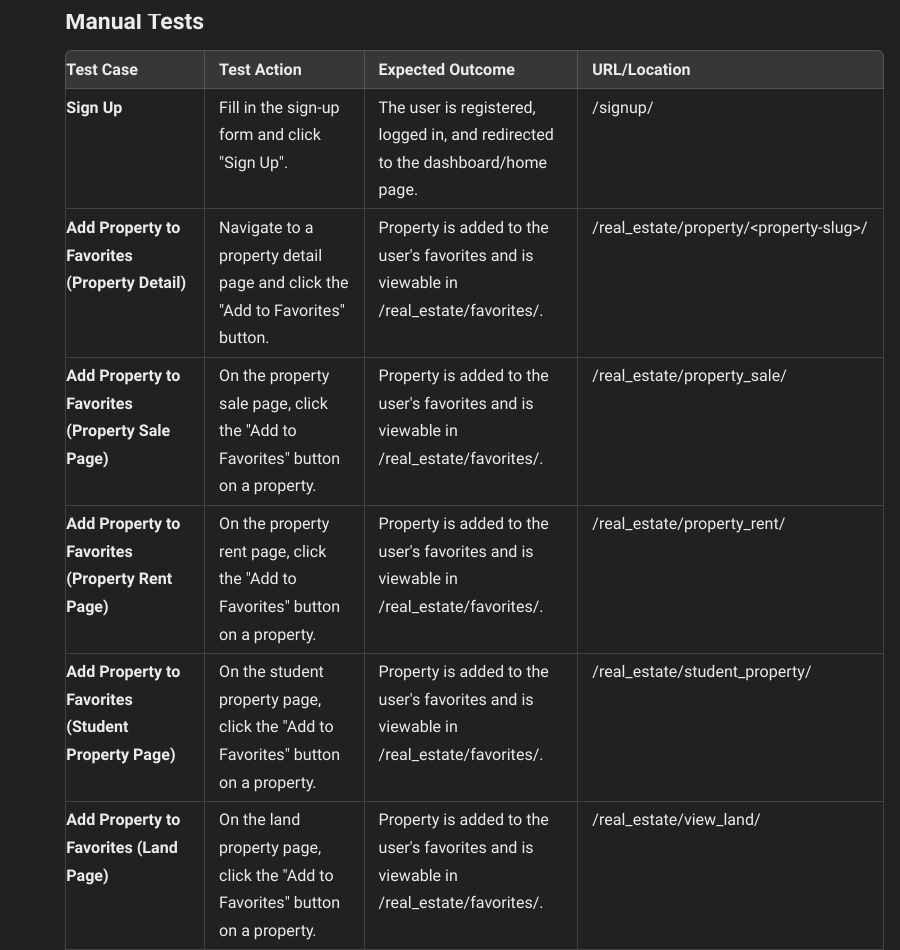
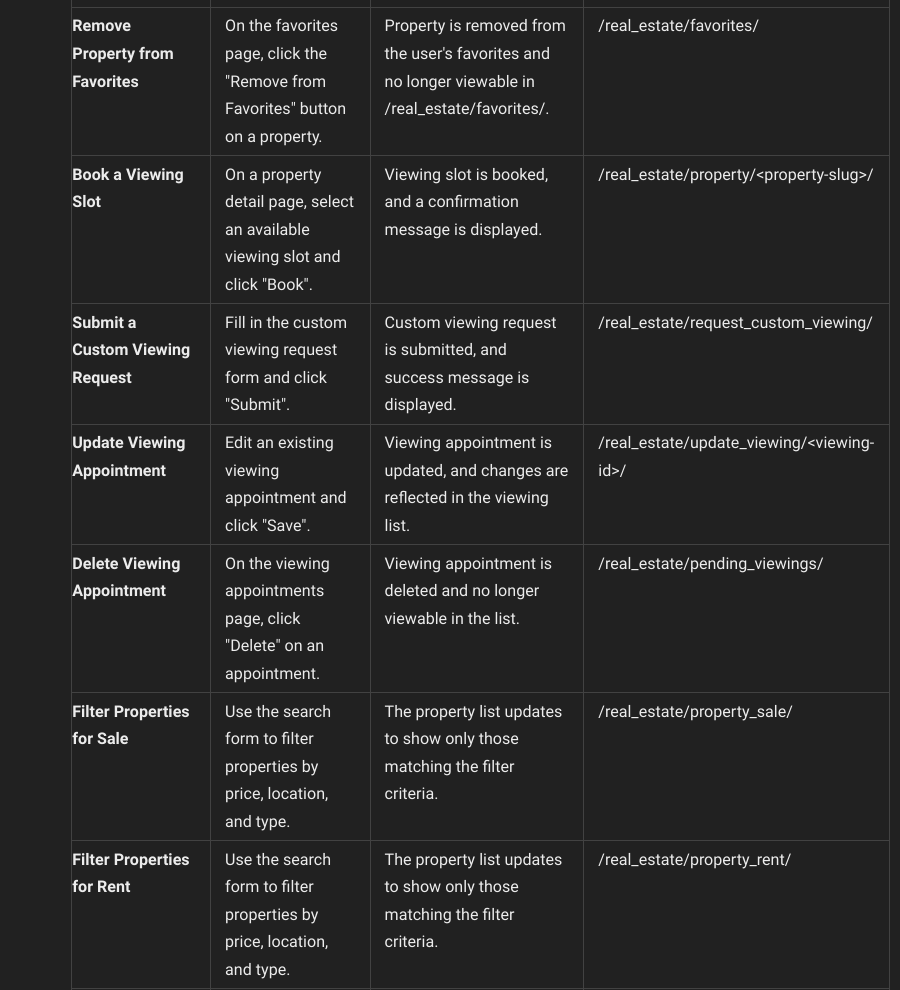
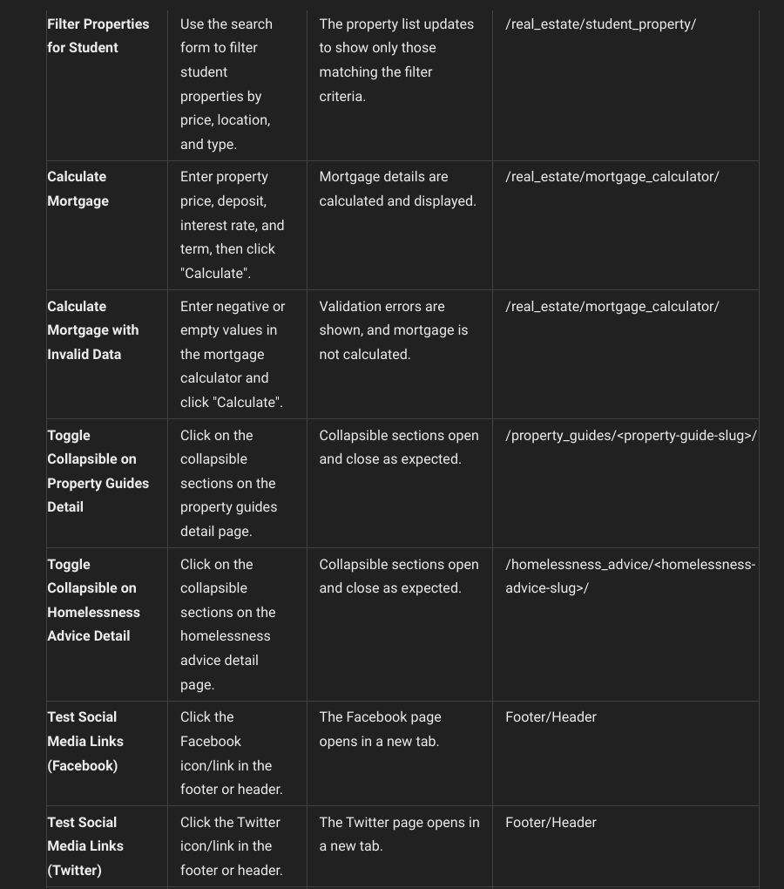
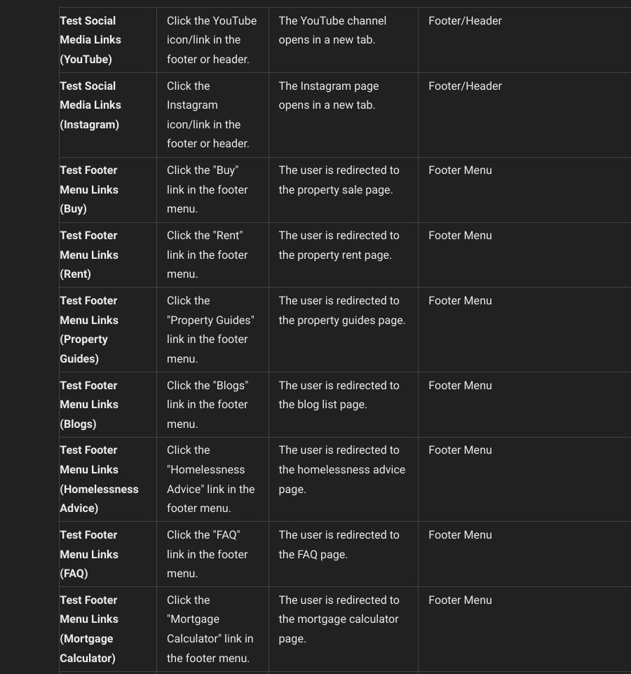
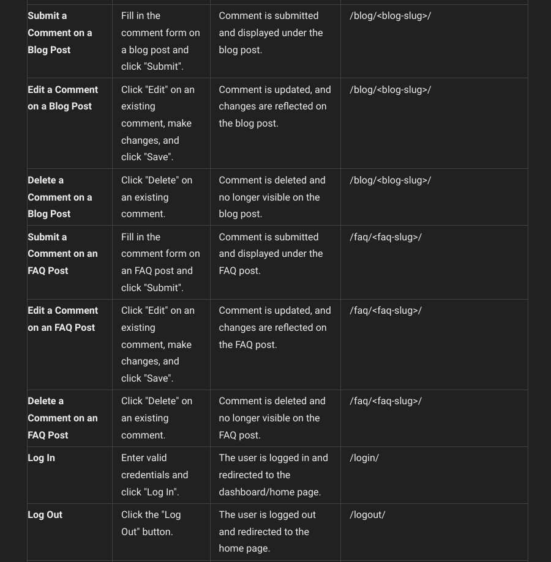
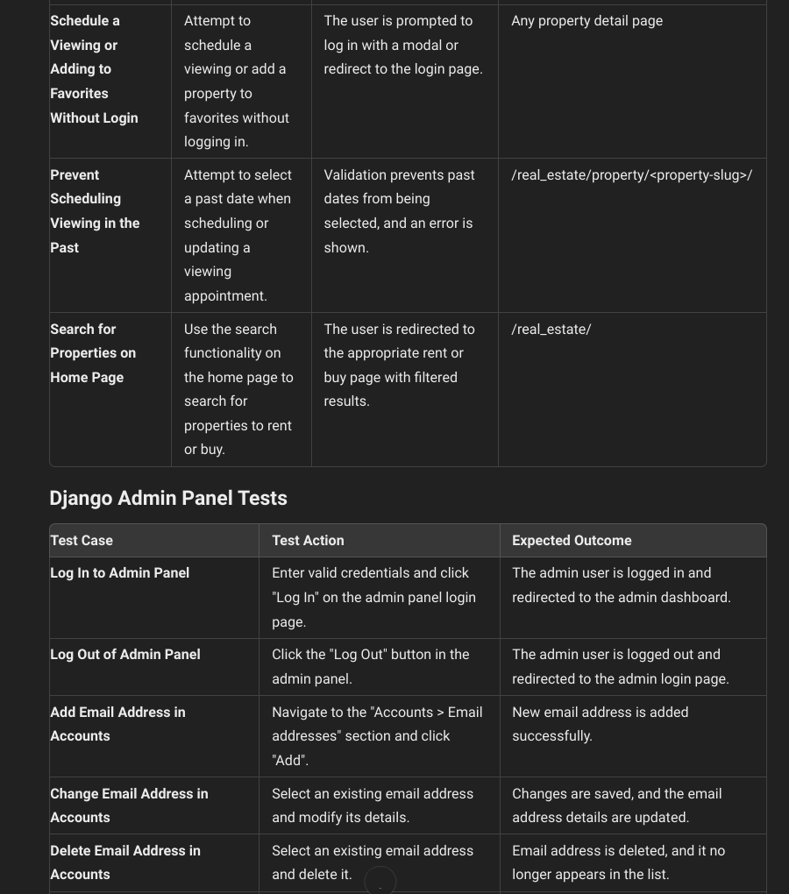
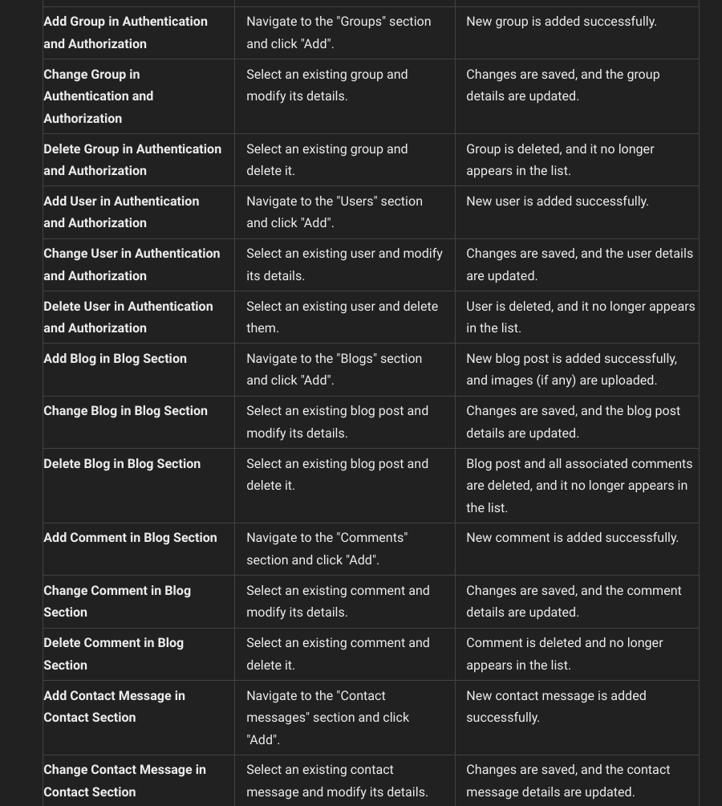
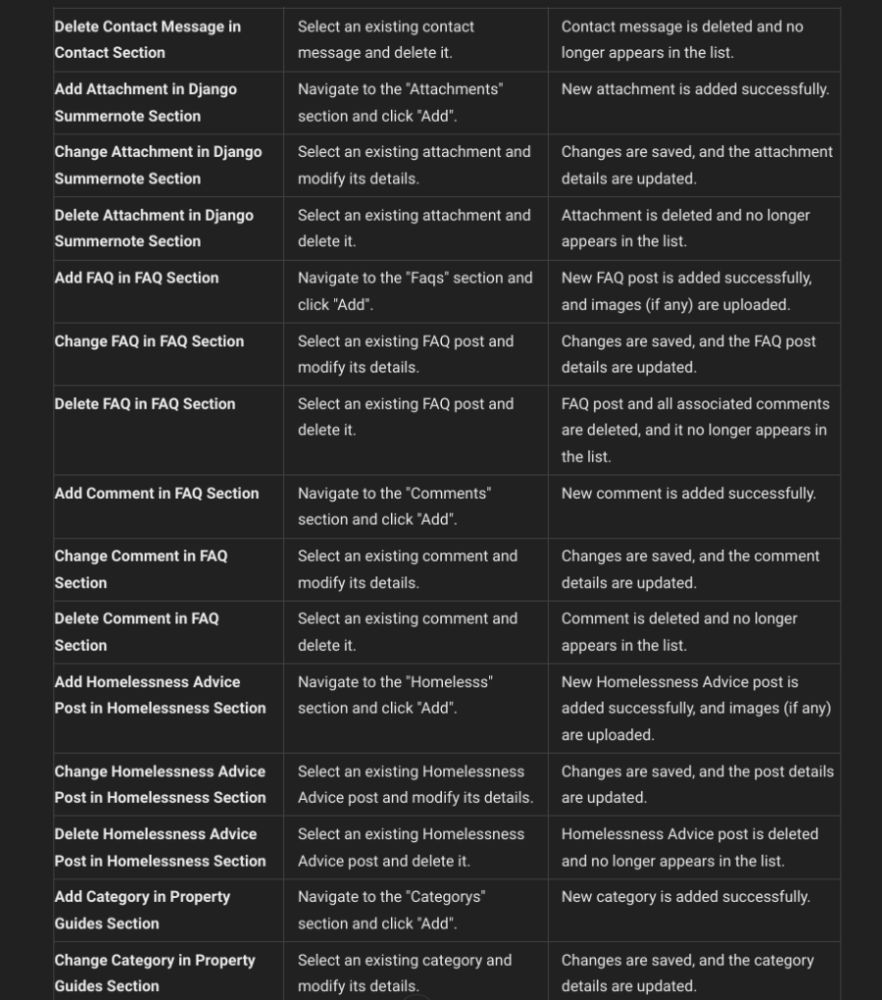
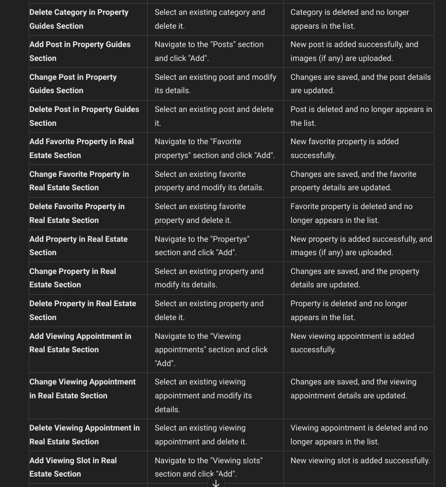
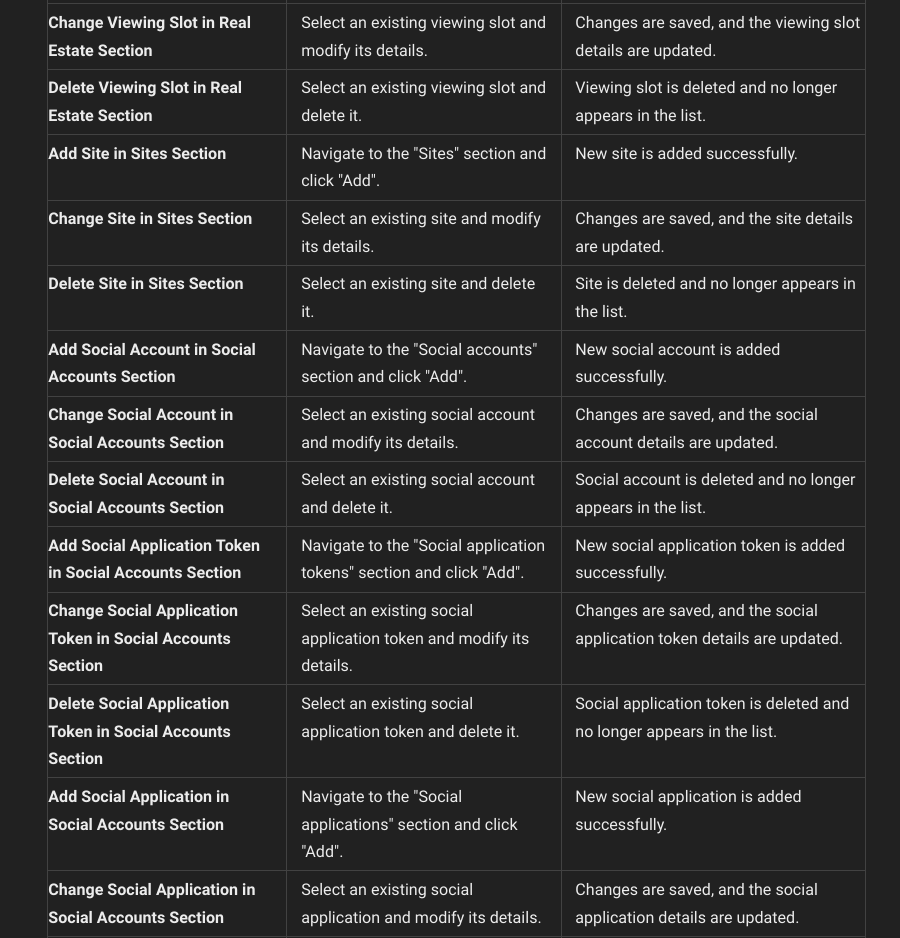
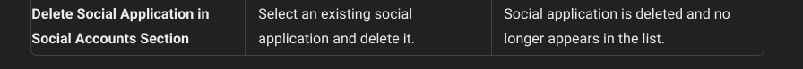

### Validator Testing

The project has been tested against several validators to ensure code quality and compliance with web standards.

### Accessibility

Accessibility has been tested using tools like Lighthouse to ensure the site is usable by people with disabilities.

### Browser Testing

The project has been tested on multiple browsers (Chrome, Firefox, Safari) to ensure cross-browser compatibility.

## Bugs

### Fixed Bugs

1. **HTML Validation Error:**
   - **Issue:** Validation errors were present on the signup.html page due to incorrect HTML structure.
   - **Fix:** Updated the signup.html page to ensure no validation errors, ensuring the HTML structure adheres to W3C standards.

2. **Issue with HTML Escaping in Summernote Content:**
   - **Issue:** Text entered through Summernote was being displayed with HTML escaping, causing issues with the rendered content.
   - **Fix:** A utility function was created in the `utils.py` file to clean and process the HTML content from Summernote. The function includes:
     - Replacing `<font>` tags with `<span>` tags to ensure proper styling.
     - Unescaping HTML entities.
     - Sanitizing the HTML using the `bleach` library, allowing specific tags, attributes, and styles while removing any harmful content.
     - Removing empty `style` attributes and trailing spaces to clean up the final HTML output.
   - **Code Snippet:**
     ```python
     import re
     import bleach
     from html import unescape

     def replace_font_with_span(html):
         font_open_tag_pattern = re.compile(r'<font\s+color="([^"]+)">')
         font_close_tag_pattern = re.compile(r'</font>')
         html = font_open_tag_pattern.sub(r'<span style="color:\1;">', html)
         html = font_close_tag_pattern.sub('</span>', html)
         return html

     def clean_html_content(html):
         html = unescape(html)
         allowed_tags = [
             'p', 'b', 'i', 'u', 'h1', 'h2', 'h3', 'h4', 'h5', 'h6',
             'span', 'ul', 'ol', 'li', 'strong', 'br', 'em', 'blockquote', 'a'
         ]
         allowed_attrs = {
             'span': ['style'],
             'a': ['href', 'title', 'style'],
             '*': ['style']
         }
         allowed_styles = ['color']
         html = replace_font_with_span(html)
         cleaned_html = bleach.clean(html, tags=allowed_tags, attributes=allowed_attrs, styles=allowed_styles, strip=False)
         cleaned_html = re.sub(r'style="\s*"', '', cleaned_html)
         cleaned_html = re.sub(r'\s+>', '>', cleaned_html)
         return cleaned_html
     ```

## Technology

- **Django**: The main framework used for development.
- **Cloudinary**: Used for image storage and management.
- **Django Summernote**: Rich text editor for blog and property descriptions.
- **Bootstrap**: Frontend framework for styling and responsiveness.
- **CIPostgreSQL**: Database for storing project data.
- **Python**: The programming language used for backend logic.
- **Graphviz**: Used to generate the database schema diagram.
- **JavaScript**: Used for enhancing user interactivity and front-end dynamic behavior.
- **HTML**: The standard markup language for creating web pages.
- **CSS**: Used for styling and designing the visual layout of the web pages.
- **Google Fonts**: Used for font styles in headers and other text elements.
- **DevTools**: Utilized for debugging, improvement, and use of device emulators.
- **Font Awesome**: Integrated for icons and font styles, especially in the footer.
- **ChatGPT 3.5**: Leveraged for reviewing code, finding discrepancies, and spell-checking.
- **HTML Validation Service**: Used for validating the structure and syntax of HTML files.
- **CSS Validation Service**: Used for ensuring that the CSS follows standards and is error-free.
- **Pixabay, Pexels, Unsplash, Shutterstock**: Sources for images used in the project.
- **Photopea**: An online tool used for resizing and editing images.
- **Citizens Advice**: For the information regarding housing used for the homeless, blog and FAQ pages.

## Deployment

The project is deployed on Heroku. Follow these steps to deploy your own instance:

1. **Clone the repository**:
   ```bash
   git clone <repo_url>
